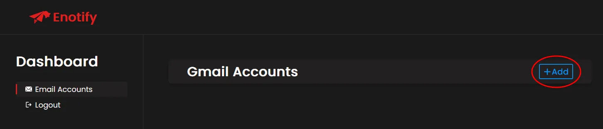
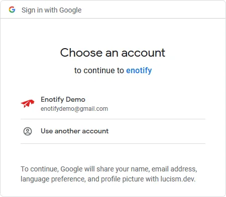
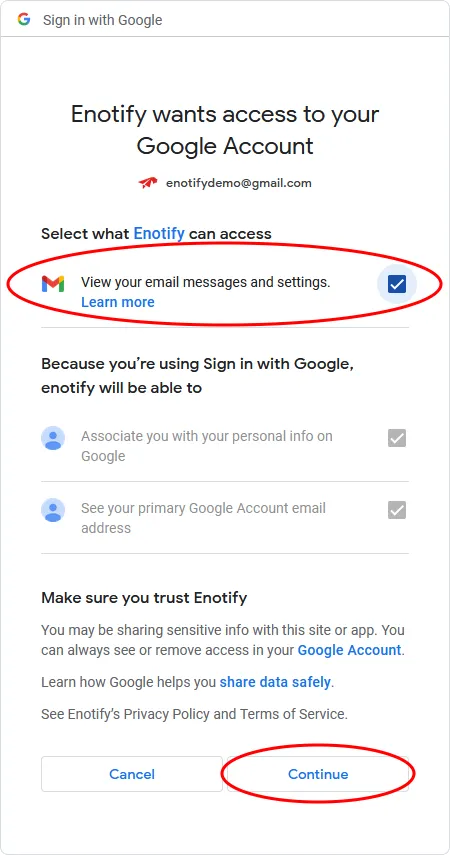

# Adding a Gmail Account
Once logged in to the <a href="https://enotify.lucism.dev/dashboard" target="_blank">enotify dashboard</a>, navigate to the <a href="https://enotify.lucism.dev/dashboard?tab=email_accounts" target="_blank">Email Accounts</a> tab, then proceed to press the the **Add** button on the **Gmail Accounts** section.

 

Proceed with the google login process, selecting the account you wish to recieve notifications for.

 

If prompted, ensure that you tick the box next to "**View your email messages and settings.**", this will allow Enotify to send you information about the email sender and email subject when notifying you of an incoming email.

To complete the authentication process, press **Continue**.

 

If you completed the previous steps correctly, you now should have been redirected back to the dashboard, and see that the google account you signed in with is now listed under the **Gmail Accounts** section.

