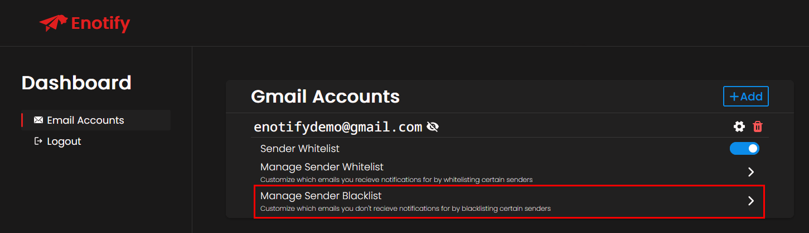
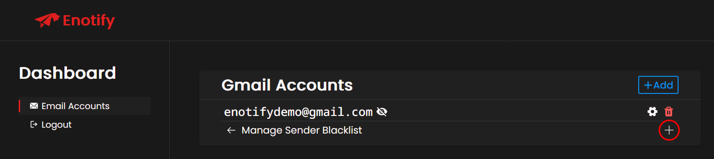
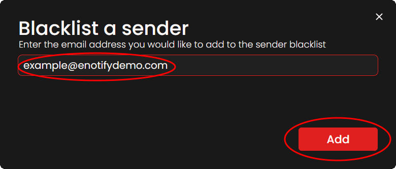

# Blacklisting Senders

If you wish to not recieve email notifications for certain senders, you can add said senders to the sender blacklist on a per email account basis.

## Blacklisting a sender
Firstly, Navigate to the **Manage Sender Blacklist** option of your desired email account.

Next, press the **+** button on the right.

Finally, specify the sender you wish to blacklist, and press the **Add** button.

Congratulations! If you completed the previous steps successfully, you will no longer recieve email notifications for the senders that you blacklist.
