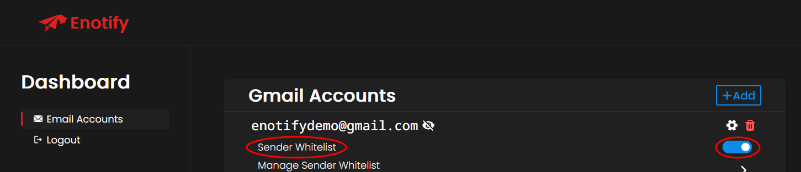
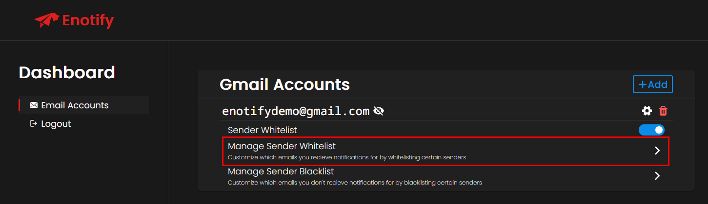
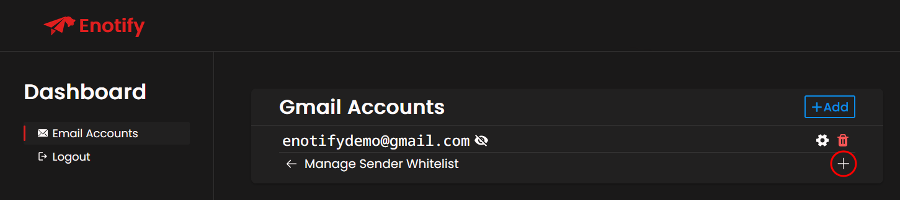
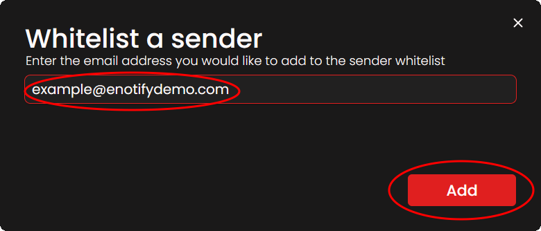

# Whitelisting Senders

In order to **fine tune what you get email notifications for**, you are able to **whitelist certain senders** on a per email account basis.

## Enabling the sender whitelist
In order to enable the sender whitelist for an email account, navigate to the <a href="https://enotify.lucism.dev/dashboard?tab=email_accounts" target="_blank">Email Accounts</a> tab of the <a href="https://enotify.lucism.dev/dashboard" target="_blank">Enotify dashboard.</a> Select the email account that you wish to enable the sender whitelist of, and ensure that **Sender Whitelist** is switched **on**.

If you completed the previous step successfully, **Sender Whitelist** should be switched on, and **you should only recieve notifications for emails sent by senders that you specify**.

## Whitelisting a sender
Now that the **Sender Whitelist** option is switched on, you need to specify the senders that you wish to whitelist.

Firstly, Navigate to the **Manage Sender Whitelist** option of your desired email account.

Next, press the **+** button on the right.

Finally, specify the sender you wish to whitelist, and press the **Add** button.

Congratulations! If you completed the previous steps successfully, you will now recieve email notifications only for the senders that you whitelist.
