# Configuring Pub/Sub

Navigate to `Pub/Sub > Topics` on the dashboard for your Google Cloud project, then press **+ CREATE TOPIC**.

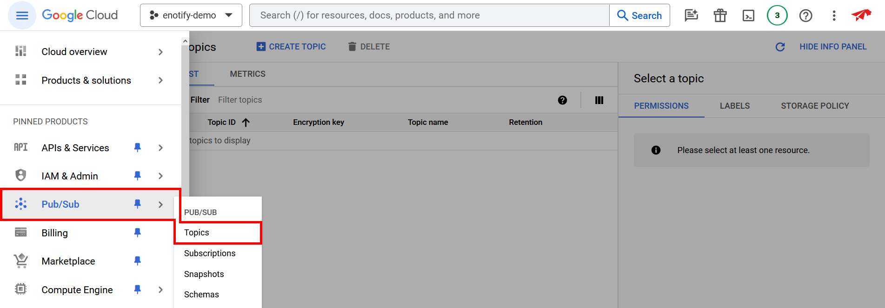
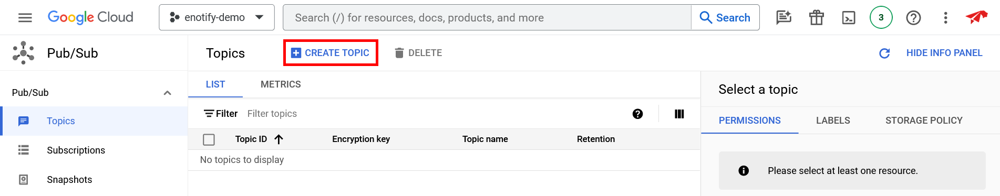

 

Choose a **Topic ID**, ensure that **Add a default subscription** is selected, then press **CREATE**.

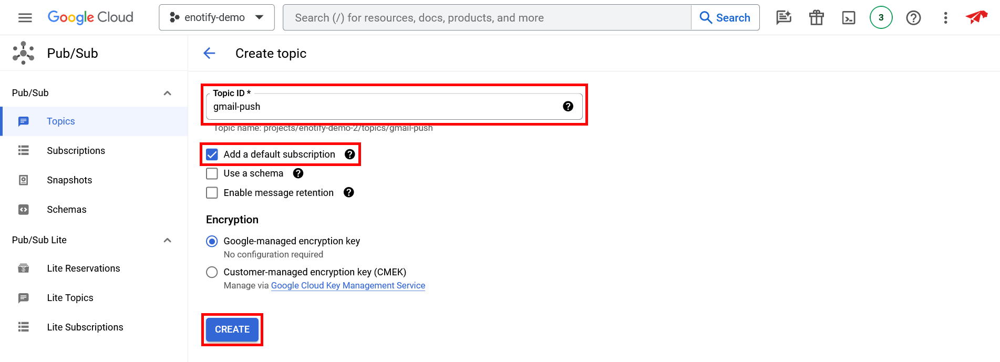

 

Copy the **Topic name** of your newly created topic, open the `.env` file in the cloned repository's files, and paste it as the `gcloud_topic_name` environment variable value.

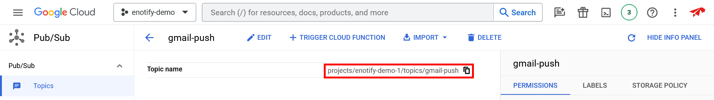
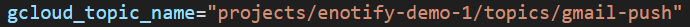

 

Next, select the subscription listed under your newly created topic, and press **EDIT**.

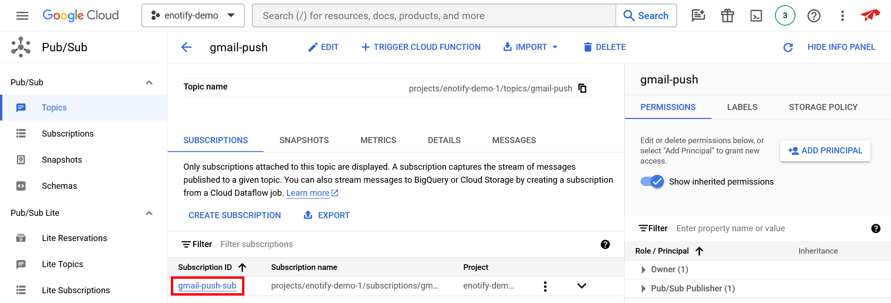
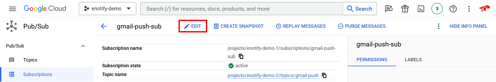

 

Set **Delivery type** to **Push**, and set the **Endpoint URL** to the base URL you will be hosting your instance of Enotify's website on, followed by the `/gmail/push` route as well as the `?token=SOME_RANDOM_TOKEN` query parameter. In this example we are using `https://example.com` as our base URL, so our **Endpoint URL** would be `https://example.com/gmail/push?token=SOME_RANDOM_TOKEN`.

Be sure to replace `SOME_RANDOM_TOKEN` with a long, randomly generated string, then copy it to your clipboard. Open the `.env` file in the cloned repository's files, and paste your randomly generated string as the `gmail_push_route_token` environment variable value.

Make sure **Enable authentication** is checked, then select an available service account from the **Service account** dropdown.

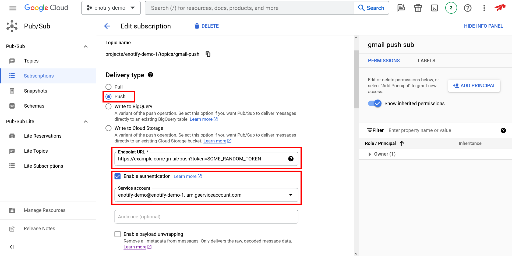
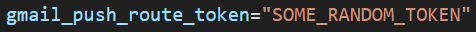

 

Under **Expiration period**, select **Never expire**.

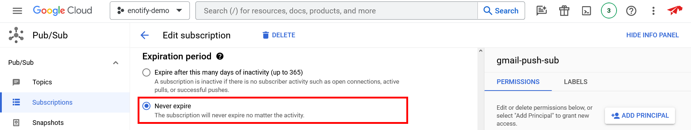

 

Set the **Retry policy** to **Retry after exponential backoff delay**, with a range of `25` - `600`, and then press **UPDATE**.

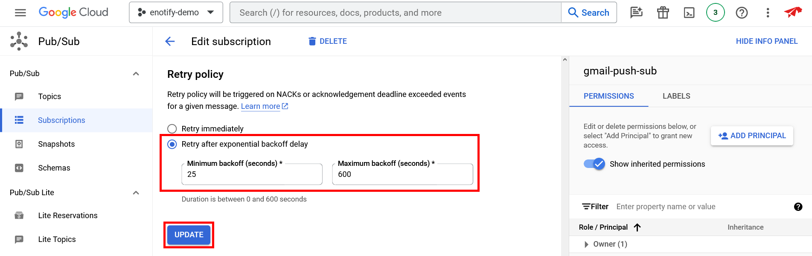

 

Congrats! Your Google Cloud project is now setup for to be used by Enotify!
