# Creating Google Cloud Project

Firstly, head over to [Google Cloud Console > New Project](https://console.cloud.google.com/projectcreate) and **make sure you are logged into the google account you wish to create the Google Cloud Project on**.

 

Give your project a name, and optionally, a custom ID, then press **CREATE**.

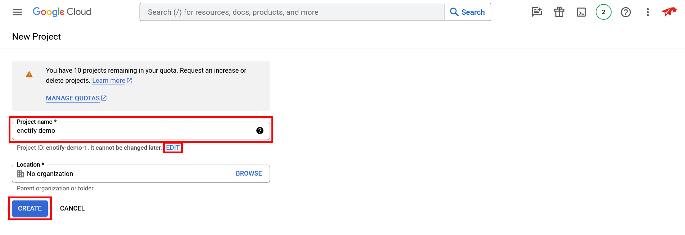

 

## Enable Gmail API

In your newly created project, navigate to `APIs & Services > Enabled APIs & Services`.

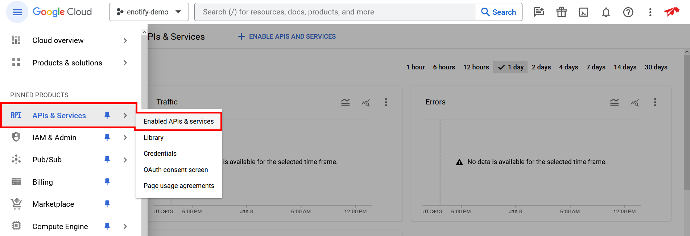

Press the **+ ENABLE APIS AND SERVICES** button at the top of the page, then scroll down and select the `Gmail API` panel listed under the `Google Workspace` category.

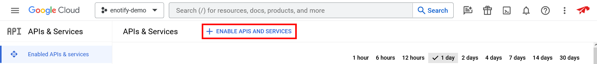
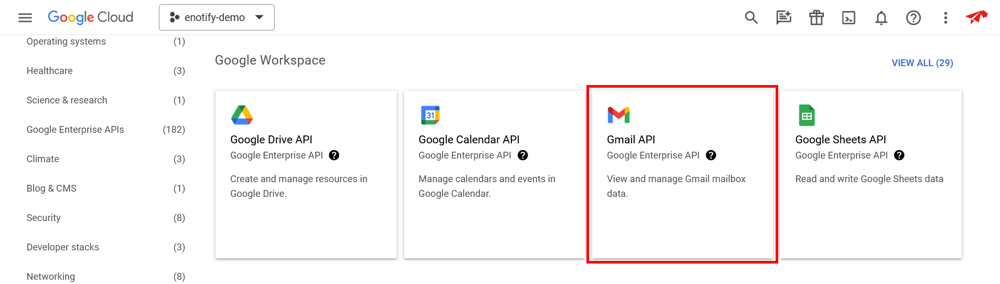

 

Once on the Gmail API page, press the **ENABLE** button to enable the Gmail API.

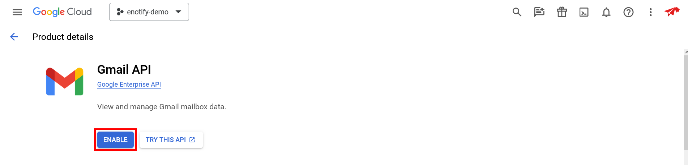

 

## Create credentials

After enabling the Gmail API, you must create credentials in order to interact with it. Press the **CREATE CREDENTIALS** button.

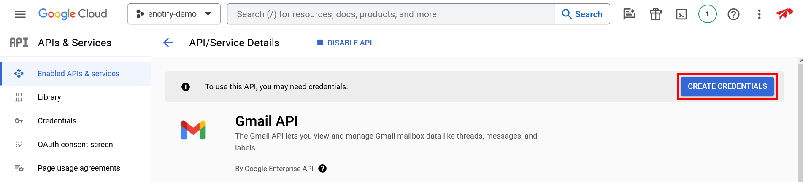

 

In the **Select an API** dropdown, ensure that **Gmail API** is selected. Select **User data** and press **NEXT**.

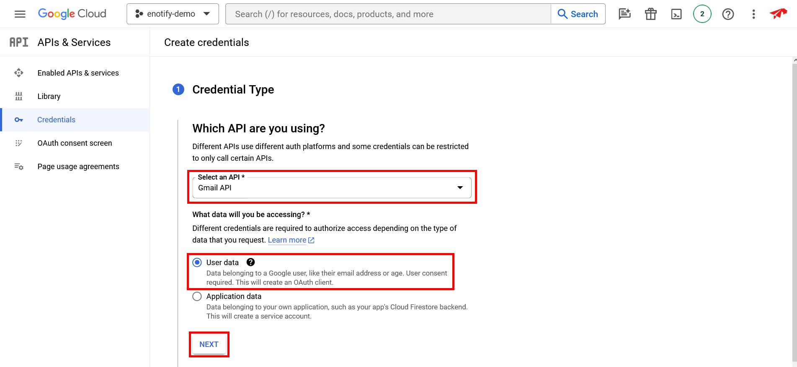

 

Choose an **App name**, select an available **User support email**, add at least one email address under **Developer contact information**, and optionally, upload a logo. Once complete, press **SAVE AND CONTINUE**.

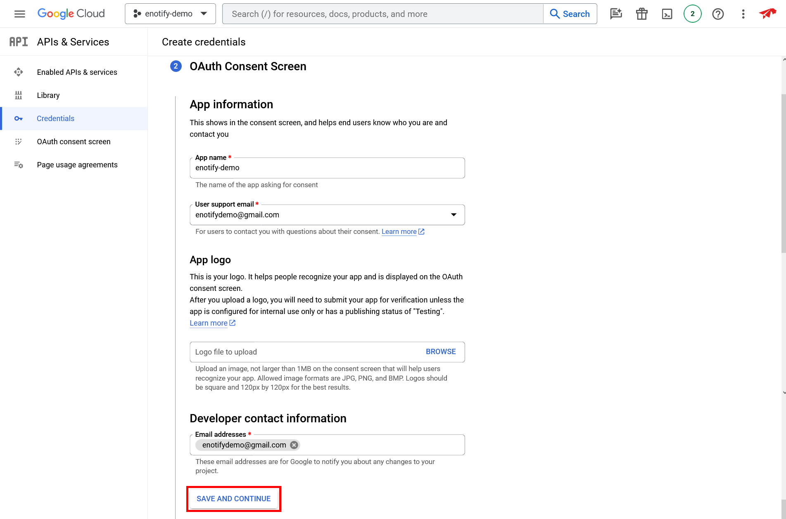

 

Next, you must add the scopes required in order for Enotify to function. First press **ADD OR REMOVE SCOPES**, then select `https://www.googleapis.com/auth/userinfo.email` as well as `https://www.googleapis.com/auth/gmail.readonly`. Once both are selected, press **UPDATE**.

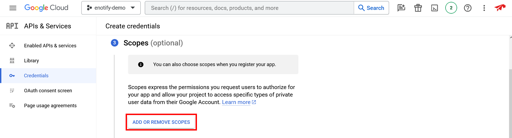
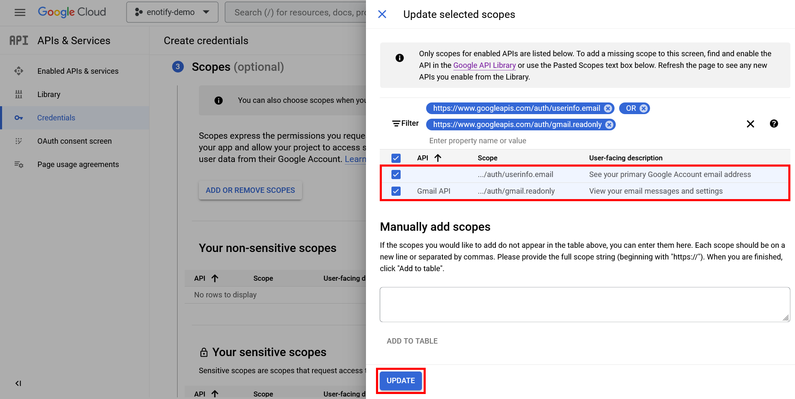

Scroll down to the bottom of the *Scopes* section and press **SAVE AND CONTINUE**.

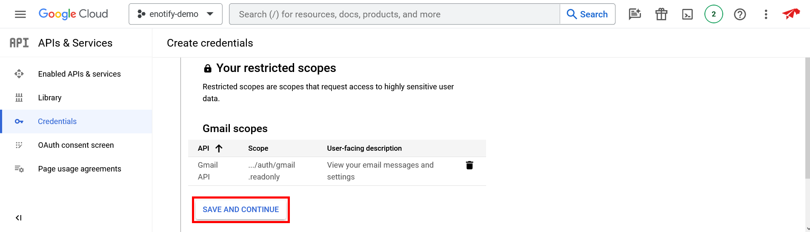

 

Next, you must setup your *OAuth Client ID*. For **Application type** select **Web application**, and choose a name for your client ID.

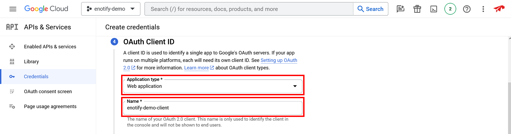

Under *Authorized JavaScript origins*, add the base URL that you will be hosting your instance of Enotify's website on. In this example, we are using `https://example.com` as a base URL.

Under *Authorized redirect URIs*, add the base URL that you will be hosting your instance of Enotify's website on, followed by the `/gmail/callback` route. In this example we are using `https://example.com` as a base URL, therefore we add `https://example.com/gmail/callback` as an *Authorized redirect URI*.

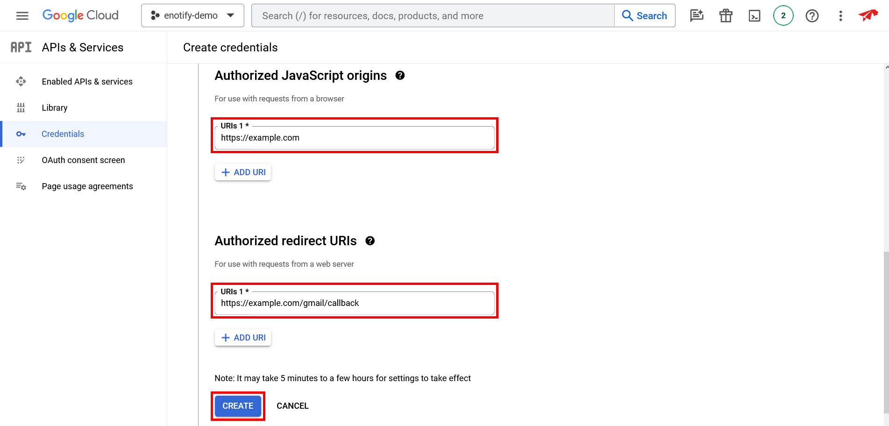

 

Scroll down to the bottom of the *Create credentials* page, and press **DONE**.

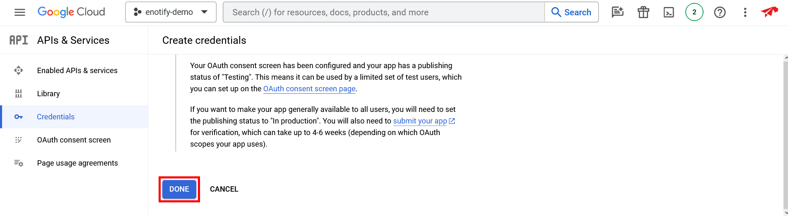

 

## Save credentials

Now that you have created your *OAuth Client ID*, you must save the credentials for it. Navigate to the `APIs & Services > Credentials` page, and press the pencil (edit) button next to your newly created OAuth client ID.

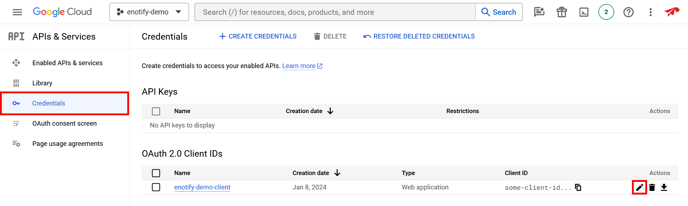

 

Copy the **Client ID**, and **Client secret** on the right side of the screen, open the `.env` file in the cloned repository's files, and paste them as the `gcloud_client_id` and `gcloud_client_secret` environment variable values.

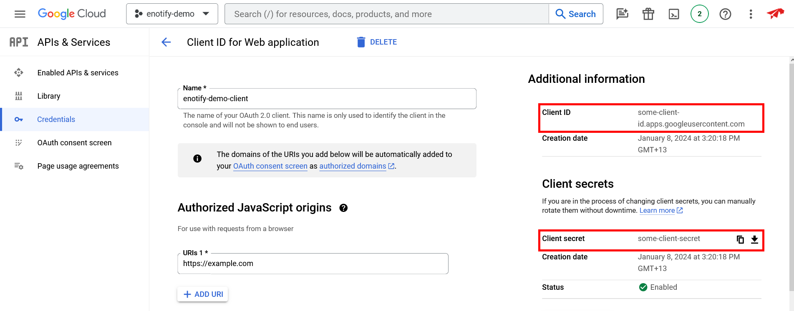
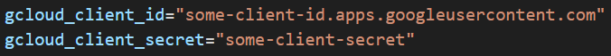

 

## Add test users

In order to use the Gmail API with Enotify before your Google Cloud project is verified, you must add yourself as a test user.

To add yourself as a test user navigate to `APIs & Services > OAuth consent screen` and press the **+ ADD USERS** button below *Test users*.

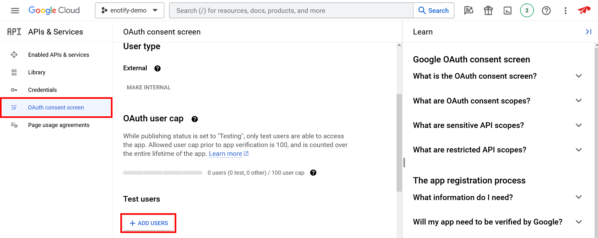

 

Enter the desired test user email address and press **SAVE**.

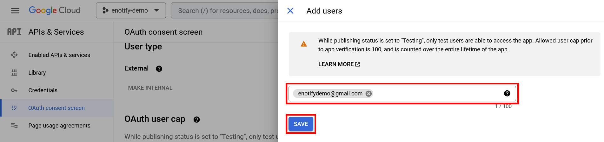