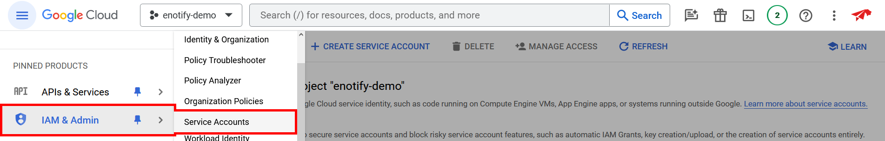
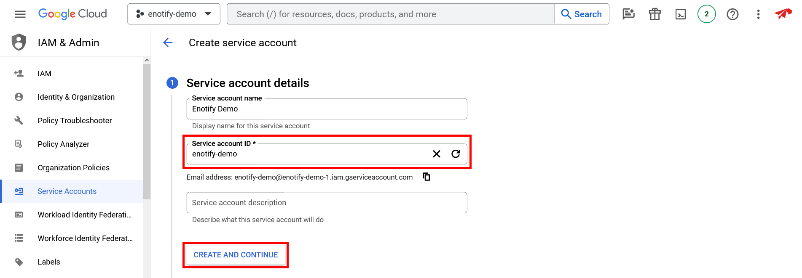
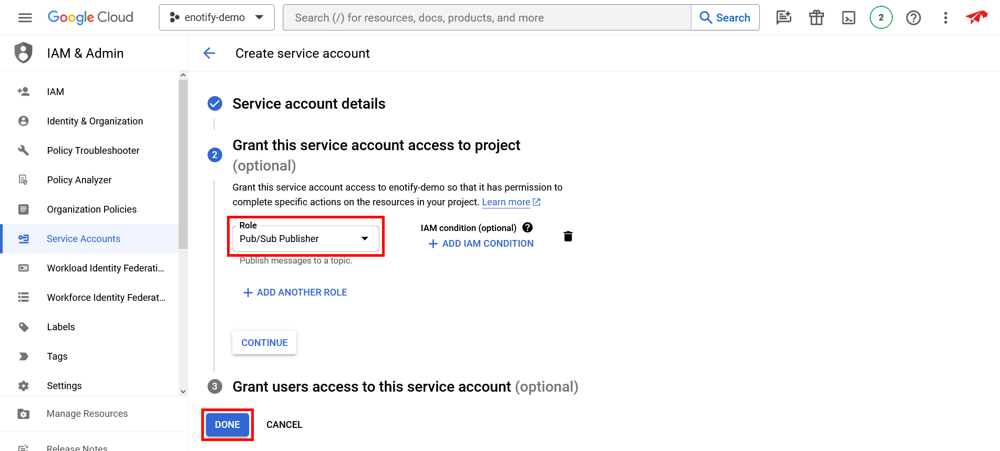
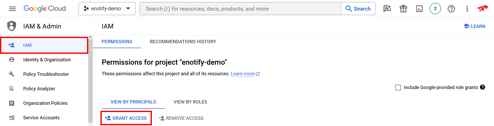
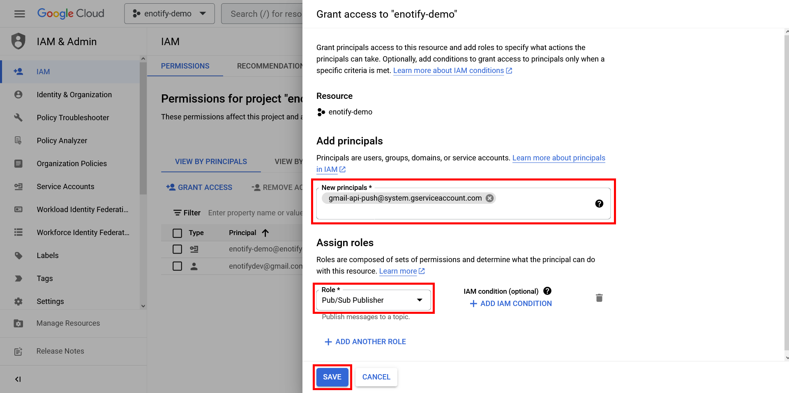

# Setting up IAM service accounts

Navigate to `IAM & Admin > Service Accounts` on the dashboard for your Google Cloud project, then press **+ CREATE SERVICE ACCOUNT**.

 

Enter a **Service account ID**, and optionally a **Service account name** as well as a **Service account description**. Press **CREATE AND CONTINUE** to proceed.

 

Add the **Pub/Sub Publisher** role and press **DONE**.

 

Navigate to `IAM & Admin > IAM` and press **GRANT ACCESS**.

 

Under *Add principals*, add `gmail-api-push@system.gserviceaccount.com` to the list of **New principals**. Next, assign the **Pub/Sub Publisher** role, then press **SAVE**.

