# Setting up a Discord Bot
In order to actually recieve notifications for new emails, you need a discord bot.

## Creating the discord bot
Navigate to the [Discord Developer Portal > Applications](https://discord.com/developers/applications) and press `New Application`.

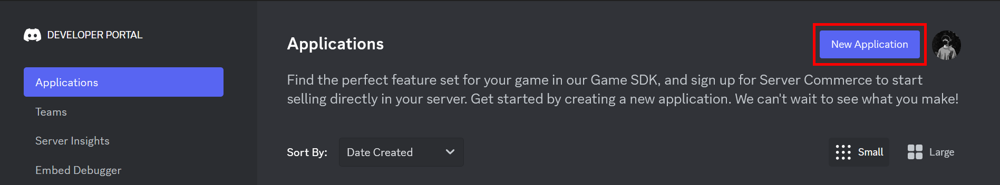

 

Give your application a **NAME**, accept the **Discord Developer Terms of Service and Developer Policy**, and press **Create**.

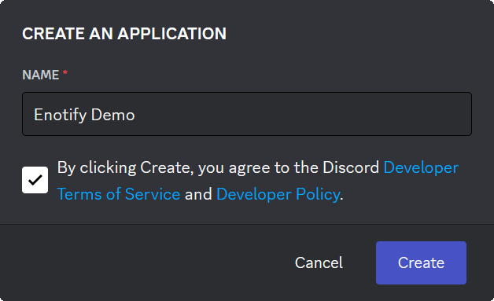

 

## Resetting the discord bots's token
Navigate to the **Bot** tab on the sidebar and press **Reset Token**. Press **Yes, do it!** to confirm. Enter your 2FA code it prompted.

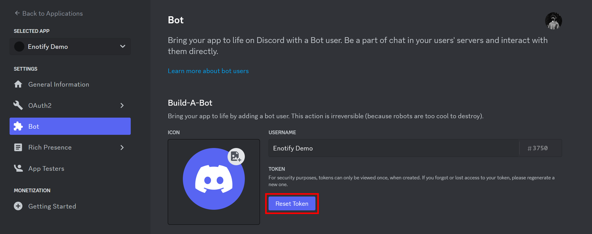
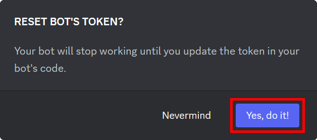

 

Copy the newly generated bot token, open the `.env` file in the cloned repository's files and paste the copied token as the `bot_token` environment variable value.

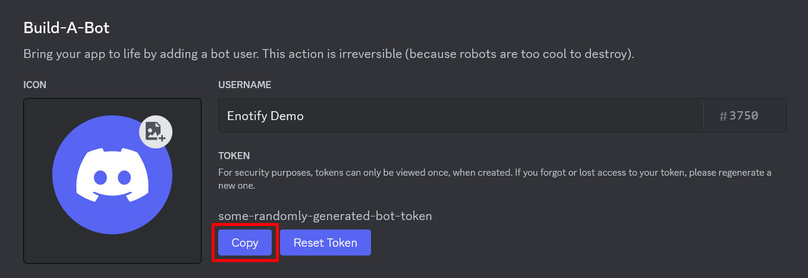
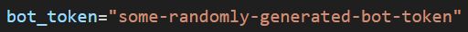

## Setting up OAuth for the discord bot

Navigate to the **OAuth2 > General** tab on the sidebar and press the **Copy** button below **CLIENT ID**. Open the `.env` file in the cloned repository's files and paste the copied client ID as the `bot_client_id` environment variable value.

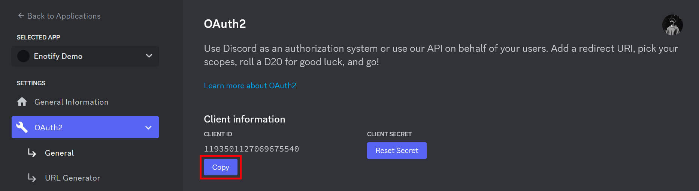
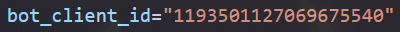

 

Now, reset bot's **CLIENT SECRET** by pressing the **Reset Secret** button. Similarly to resetting the bot's token, press **Yes, do it!**, and enter your 2FA code if prompted.

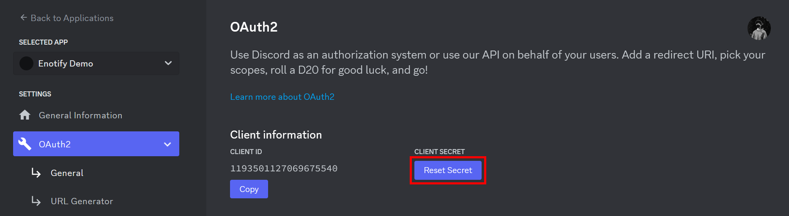

Press the **Copy** button below your newly generated client secret in order to copy it to your clipboard. Open the `.env` file in the cloned repository's files and paste the copied client secret as the `bot_client_secret` environment variable value.

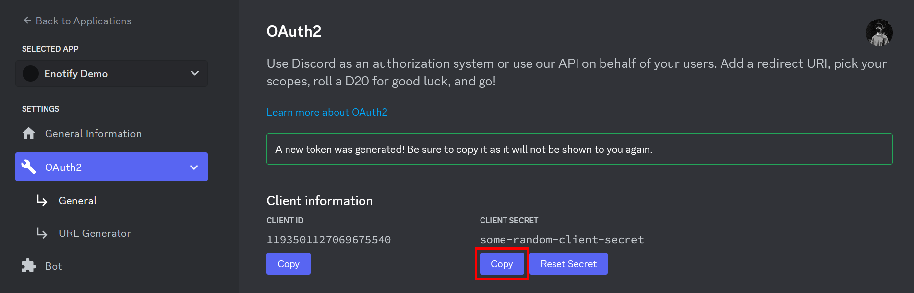
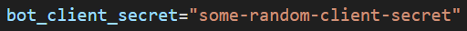

 

Next, you must add a redirect URI for your instance of Enotify's website. In order to do so, press the **Add Redirect** button.

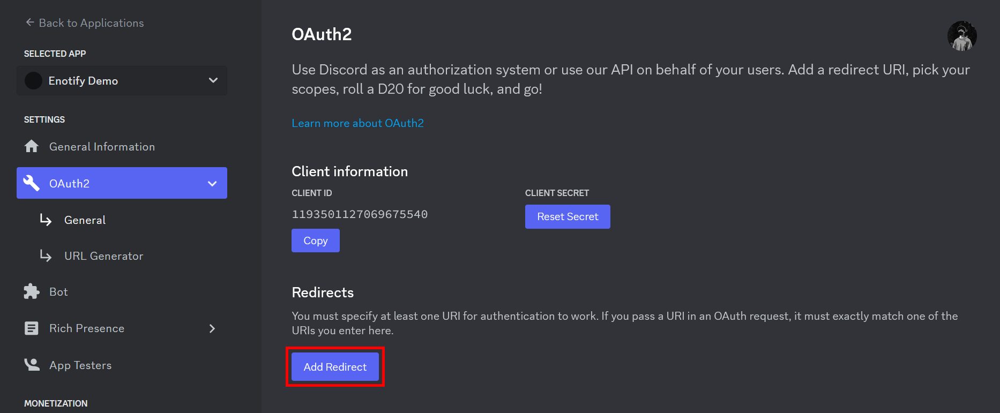

Enter the base URL you will be hosting your instance of Enotify's website on, followed by the `/discord/callback` route. In this example, we are using `https://example.com` as our base URL, so we will add the `https://example.com/discord/callback` redirect URI. Once you have entered the correct redirect URI, press **Save Changes** to confirm.

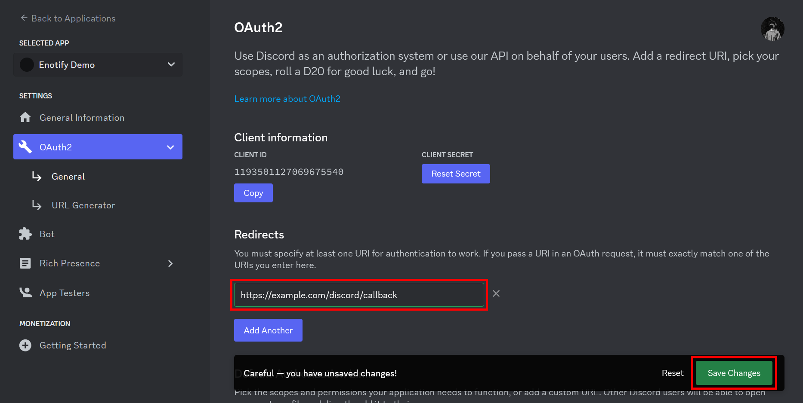

 

Congrats! Your discord bot is now all set!
